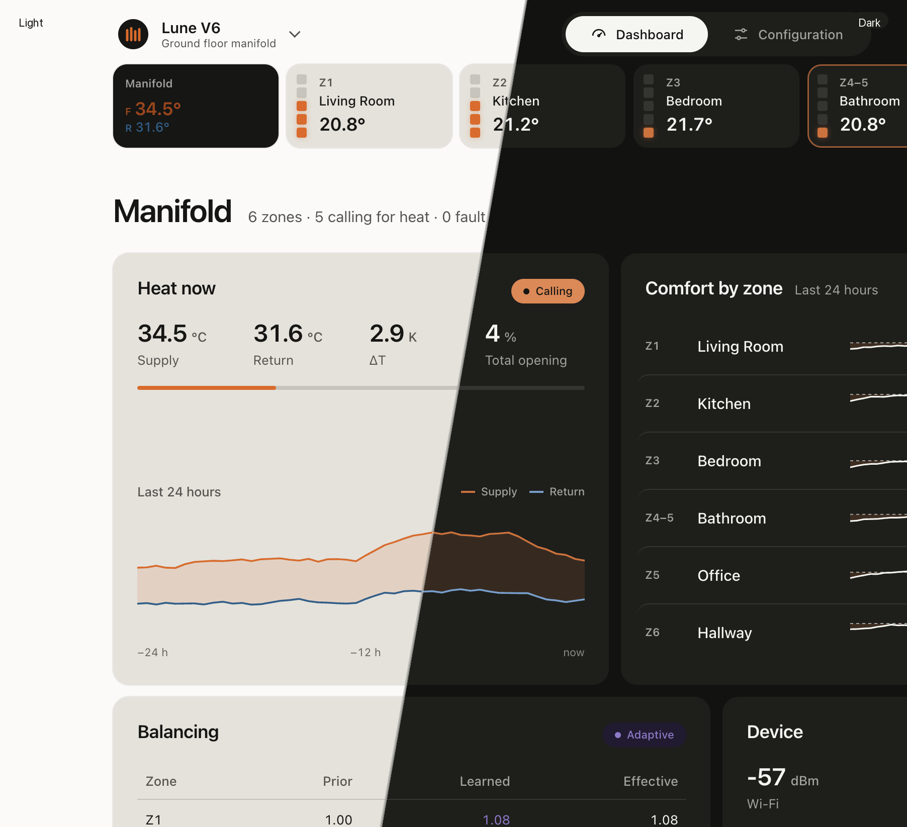

# Lune V6

Local 6-zone hydronic manifold controller (ESP32-S3 / ESPHome). Safe without a
coordinator: motors, endstops, temperature freshness, and command clamps run on
the device.



## Layout

```text
lune-v6/                 Firmware, local dashboard, hardware, tests
  configurations/        Device YAML entrypoints
  packages/              Board / hardware / network / zones
  components/            Custom C++ (lv6_*)
  web/                   Design System 2 UI (see below)
  docs/                  Manual, API, architecture
shared/contracts/        Cross-product contracts (e.g. room physics)
docs/                    Cross-device notes
```

Lune Touch / Mini lives in the private repo
[`Birkemosen/lune-coordinator`](https://github.com/Birkemosen/lune-coordinator).
Shared UI tokens and CSS come from
[`Birkemosen/lune-design-system`](https://github.com/Birkemosen/lune-design-system)
(sibling checkout `../lune-design-system`).

## Dashboard (Design System 2)

Static HTML/CSS with radio navigation; a thin binder paints live `/api/v1` data.
No ESPHome entity REST from the UI.

```text
lune-v6/web/
  build_ui.py       i18n shell → ui/{en,da}/
  i18n/             en / da catalogues
  binder-src/       esbuild → ui/binder.js (+ dashboard.js alias)
  ui/               Built CSS, HTML, binder (embedded in firmware)
  preview.html      Local mock preview
```

```bash
# requires ../lune-design-system
make design-tokens     # → lune-v6/web/ui/lune-ui.css
make dashboard-build   # HTML + binder + preview.html
```

Preview without a device:

```bash
python3 -m http.server 8765 -d lune-v6/web
# → http://127.0.0.1:8765/preview.html
```

Installer help: [`lune-v6/docs/Manual.md`](lune-v6/docs/Manual.md) (linked from in-UI `?`).
UI rules: LDS `DESIGN.md` / `AGENTS.md`. Design changes land in
**lune-design-system first**, then `make dashboard-build`.

## Hardware (rev 3.3)

Current board package: `lune-v6/packages/board/lune-v6-rev33.yaml` (`rev33_gpio`).
Two-layer USB-C ESP32-S3-WROOM-1-N8R8 controller, six 3.3 V valve channels
(3× DRV8411 + hardware one-hot decoder), shared high-side sense for ADC /
ripple / overcurrent. Hostname: `lune-v6-<mac>` (revision is not part of the
name).

See [`lune-v6/README.md`](lune-v6/README.md) and
[`lune-v6/hardware/lune-v6-rev3.3/`](lune-v6/hardware/lune-v6-rev3.3/) for the
revision table, ECO level, and firmware integration. Do not flash a rev 3.3
image on a rev 3.2 / 3.1 board — pin maps collide.

Validate the schematic:

```bash
python3 lune-v6/hardware/lune-v6-rev3.3/check_design.py
```

## Setup and commands

```bash
python3.13 -m venv .venv313
./.venv313/bin/python -m pip install -r requirements.txt
```

From the repository root (defaults to Lune V6):

```bash
make config
make dashboard-build
make build
make test
make deploy HOST=192.168.x.x
```

Device-local:

```bash
make -C lune-v6 help
make -C lune-v6 test
```

Release firmware (no WiFi secrets) → gitignored `lune-v6/dist/`:

```bash
make release-firmware VERSION=v1.1.0
```

`secrets.yaml` stays at the repo root and is gitignored.

## Boundaries

- V6 validates and clamps every command locally.
- Touch sends setpoints / weather preload — not zone choice for room temperatures.
- External hubs POST `/api/v1/room-temperatures` with `sensor_id`; V6 maps to zones.
- Shared physics contract: [`shared/contracts/lune_room_physics_contract_v1.md`](shared/contracts/lune_room_physics_contract_v1.md).
